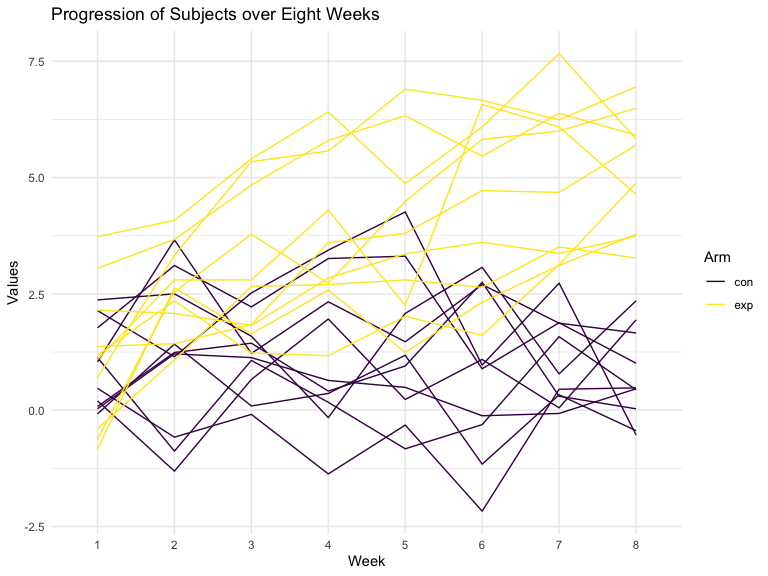
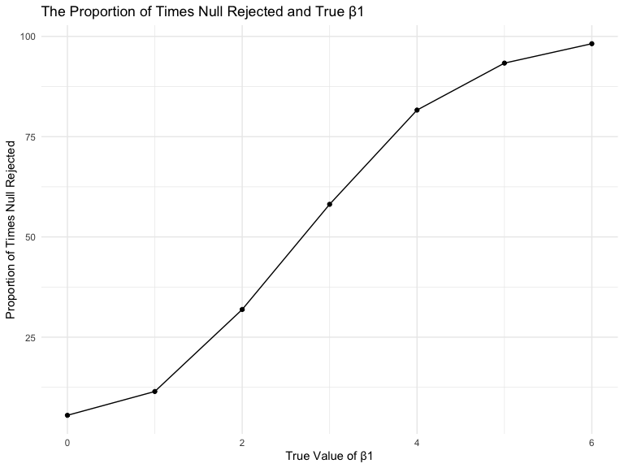
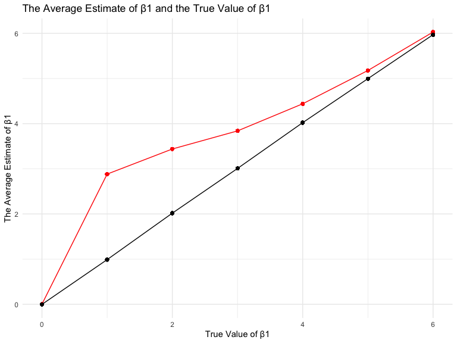

Homework 5
================
Dionna Attinson
11/5/2019

``` r
library(imputeTS)
```

    ## Registered S3 method overwritten by 'xts':
    ##   method     from
    ##   as.zoo.xts zoo

    ## Registered S3 method overwritten by 'quantmod':
    ##   method            from
    ##   as.zoo.data.frame zoo

    ## Registered S3 methods overwritten by 'forecast':
    ##   method             from    
    ##   fitted.fracdiff    fracdiff
    ##   residuals.fracdiff fracdiff

``` r
set.seed(10)

iris_with_missing = iris %>% 
  map_df(~replace(.x, sample(1:150, 20), NA)) %>%
  mutate(Species = as.character(Species))
```

## Question 1

#### In question 1, we created a function to replace N/A values. If the column was numeric, the N/A value was replaced with the average of that column. If the column contained character values, N/A values were replaced with “virginica.”

``` r
replacenavalues = function(x) { 
  if (is.numeric(x)) {
    (na_mean(x, option = "mean", maxgap = Inf)) } 
  else if (is.character(x)) {
    (replace_na(x, "virginica"))}
}
```

``` r
output = map(iris_with_missing, replacenavalues)
```

## Question 2

#### In question 2, we created a data frame using the data set given. We used the list.files function to read in the csv.

``` r
df1 =  
  tibble(Participants = list.files(path = "data/", pattern = "csv", all.files = TRUE, full.names = TRUE)) %>%
  mutate(data = map(Participants, read_csv)) %>% 
  unnest() 
```

    ## Parsed with column specification:
    ## cols(
    ##   week_1 = col_double(),
    ##   week_2 = col_double(),
    ##   week_3 = col_double(),
    ##   week_4 = col_double(),
    ##   week_5 = col_double(),
    ##   week_6 = col_double(),
    ##   week_7 = col_double(),
    ##   week_8 = col_double()
    ## )
    ## Parsed with column specification:
    ## cols(
    ##   week_1 = col_double(),
    ##   week_2 = col_double(),
    ##   week_3 = col_double(),
    ##   week_4 = col_double(),
    ##   week_5 = col_double(),
    ##   week_6 = col_double(),
    ##   week_7 = col_double(),
    ##   week_8 = col_double()
    ## )
    ## Parsed with column specification:
    ## cols(
    ##   week_1 = col_double(),
    ##   week_2 = col_double(),
    ##   week_3 = col_double(),
    ##   week_4 = col_double(),
    ##   week_5 = col_double(),
    ##   week_6 = col_double(),
    ##   week_7 = col_double(),
    ##   week_8 = col_double()
    ## )
    ## Parsed with column specification:
    ## cols(
    ##   week_1 = col_double(),
    ##   week_2 = col_double(),
    ##   week_3 = col_double(),
    ##   week_4 = col_double(),
    ##   week_5 = col_double(),
    ##   week_6 = col_double(),
    ##   week_7 = col_double(),
    ##   week_8 = col_double()
    ## )
    ## Parsed with column specification:
    ## cols(
    ##   week_1 = col_double(),
    ##   week_2 = col_double(),
    ##   week_3 = col_double(),
    ##   week_4 = col_double(),
    ##   week_5 = col_double(),
    ##   week_6 = col_double(),
    ##   week_7 = col_double(),
    ##   week_8 = col_double()
    ## )
    ## Parsed with column specification:
    ## cols(
    ##   week_1 = col_double(),
    ##   week_2 = col_double(),
    ##   week_3 = col_double(),
    ##   week_4 = col_double(),
    ##   week_5 = col_double(),
    ##   week_6 = col_double(),
    ##   week_7 = col_double(),
    ##   week_8 = col_double()
    ## )
    ## Parsed with column specification:
    ## cols(
    ##   week_1 = col_double(),
    ##   week_2 = col_double(),
    ##   week_3 = col_double(),
    ##   week_4 = col_double(),
    ##   week_5 = col_double(),
    ##   week_6 = col_double(),
    ##   week_7 = col_double(),
    ##   week_8 = col_double()
    ## )
    ## Parsed with column specification:
    ## cols(
    ##   week_1 = col_double(),
    ##   week_2 = col_double(),
    ##   week_3 = col_double(),
    ##   week_4 = col_double(),
    ##   week_5 = col_double(),
    ##   week_6 = col_double(),
    ##   week_7 = col_double(),
    ##   week_8 = col_double()
    ## )
    ## Parsed with column specification:
    ## cols(
    ##   week_1 = col_double(),
    ##   week_2 = col_double(),
    ##   week_3 = col_double(),
    ##   week_4 = col_double(),
    ##   week_5 = col_double(),
    ##   week_6 = col_double(),
    ##   week_7 = col_double(),
    ##   week_8 = col_double()
    ## )
    ## Parsed with column specification:
    ## cols(
    ##   week_1 = col_double(),
    ##   week_2 = col_double(),
    ##   week_3 = col_double(),
    ##   week_4 = col_double(),
    ##   week_5 = col_double(),
    ##   week_6 = col_double(),
    ##   week_7 = col_double(),
    ##   week_8 = col_double()
    ## )
    ## Parsed with column specification:
    ## cols(
    ##   week_1 = col_double(),
    ##   week_2 = col_double(),
    ##   week_3 = col_double(),
    ##   week_4 = col_double(),
    ##   week_5 = col_double(),
    ##   week_6 = col_double(),
    ##   week_7 = col_double(),
    ##   week_8 = col_double()
    ## )
    ## Parsed with column specification:
    ## cols(
    ##   week_1 = col_double(),
    ##   week_2 = col_double(),
    ##   week_3 = col_double(),
    ##   week_4 = col_double(),
    ##   week_5 = col_double(),
    ##   week_6 = col_double(),
    ##   week_7 = col_double(),
    ##   week_8 = col_double()
    ## )
    ## Parsed with column specification:
    ## cols(
    ##   week_1 = col_double(),
    ##   week_2 = col_double(),
    ##   week_3 = col_double(),
    ##   week_4 = col_double(),
    ##   week_5 = col_double(),
    ##   week_6 = col_double(),
    ##   week_7 = col_double(),
    ##   week_8 = col_double()
    ## )
    ## Parsed with column specification:
    ## cols(
    ##   week_1 = col_double(),
    ##   week_2 = col_double(),
    ##   week_3 = col_double(),
    ##   week_4 = col_double(),
    ##   week_5 = col_double(),
    ##   week_6 = col_double(),
    ##   week_7 = col_double(),
    ##   week_8 = col_double()
    ## )
    ## Parsed with column specification:
    ## cols(
    ##   week_1 = col_double(),
    ##   week_2 = col_double(),
    ##   week_3 = col_double(),
    ##   week_4 = col_double(),
    ##   week_5 = col_double(),
    ##   week_6 = col_double(),
    ##   week_7 = col_double(),
    ##   week_8 = col_double()
    ## )
    ## Parsed with column specification:
    ## cols(
    ##   week_1 = col_double(),
    ##   week_2 = col_double(),
    ##   week_3 = col_double(),
    ##   week_4 = col_double(),
    ##   week_5 = col_double(),
    ##   week_6 = col_double(),
    ##   week_7 = col_double(),
    ##   week_8 = col_double()
    ## )
    ## Parsed with column specification:
    ## cols(
    ##   week_1 = col_double(),
    ##   week_2 = col_double(),
    ##   week_3 = col_double(),
    ##   week_4 = col_double(),
    ##   week_5 = col_double(),
    ##   week_6 = col_double(),
    ##   week_7 = col_double(),
    ##   week_8 = col_double()
    ## )
    ## Parsed with column specification:
    ## cols(
    ##   week_1 = col_double(),
    ##   week_2 = col_double(),
    ##   week_3 = col_double(),
    ##   week_4 = col_double(),
    ##   week_5 = col_double(),
    ##   week_6 = col_double(),
    ##   week_7 = col_double(),
    ##   week_8 = col_double()
    ## )
    ## Parsed with column specification:
    ## cols(
    ##   week_1 = col_double(),
    ##   week_2 = col_double(),
    ##   week_3 = col_double(),
    ##   week_4 = col_double(),
    ##   week_5 = col_double(),
    ##   week_6 = col_double(),
    ##   week_7 = col_double(),
    ##   week_8 = col_double()
    ## )
    ## Parsed with column specification:
    ## cols(
    ##   week_1 = col_double(),
    ##   week_2 = col_double(),
    ##   week_3 = col_double(),
    ##   week_4 = col_double(),
    ##   week_5 = col_double(),
    ##   week_6 = col_double(),
    ##   week_7 = col_double(),
    ##   week_8 = col_double()
    ## )

#### We then conducted other tidying that was necessary.

``` r
df2 =  
  df1 %>% 
  mutate(
    Participants = str_remove(Participants,".csv"),
    Participants = str_remove(Participants,"data//")) %>%  
pivot_longer(
  week_1:week_8,
  names_to = "Week",
  names_prefix = "week_",
  values_to = "Values")
```

``` r
df3=
 df2 %>% 
 mutate(
 Participants2 = Participants) %>% 
 separate(Participants, into=c("Arm", "Subject_ID"), sep="_")
```

#### Next, we created a spaghetti plot showing observations on each subject over time.

``` r
df3 %>% 
ggplot(aes(x = Week, y = Values, group = Participants2, color = Arm)) + 
geom_line() +
  viridis::scale_color_viridis(
    name = "Arm", 
    discrete = TRUE, 
    option = "viridis"
  ) + 
  theme_minimal() +
  labs(
    x = "Week",
    y = "Values", 
    title = "Progression of Subjects over Eight Weeks")
```



#### We see in the plot above, that those in the experimental group had higher scores as the weeks progressed in comparison to the control group.

## Question 3

#### First, we set the design elements by creating a function.

``` r
set.seed(10)

sim_regression = function(n=30, beta0=2, beta1=0){
  simdata = tibble(
    x = rnorm(n),
    y = beta0 + beta1 * x + rnorm(n, 0, sqrt(50))
  )
ls_fit = lm(y~x, data = simdata) %>% 
  broom::tidy()

tibble(
  be1 = ls_fit[[2,2]],
  pvalue = ls_fit [[2,5]])
}
```

#### We then generated 10000 datasets from the model and repeated it for β1={1,2,3,4,5,6}.

``` r
sim_results =
  tibble(
    beta1 = c(0,1,2,3,4,5,6)) %>% 
  mutate(
    output_list = map(.x = beta1, ~rerun(10000, sim_regression(beta1 = .x))),
         estimate = map(output_list, bind_rows)) %>% 
  select(-output_list) %>% 
  unnest(estimate)
```

#### Plot 1 shows the proportion of times the null was rejected (the power of the test) on the y axis and the true value of β1 on the x axis.

``` r
plot1=
sim_results %>% 
  group_by(beta1) %>% 
  count(rejected = pvalue < 0.05) %>% 
  mutate(proportion = n/sum(n)*100) %>% 
  filter(rejected == TRUE)
```

``` r
plot1 %>% 
ggplot(aes(x = beta1, y = proportion)) +
  geom_point() + 
  geom_line() +
  labs(
    title = "The Proportion of Times Null Rejected and True β1",
    x = "True Value of β1",
   y = "Proportion of Times Null Rejected" )
```



#### In this plot, we see that as β1 increases, power and the effect size also increases.

#### We then overlayed two plots. The black line shows the average estimate of β1 on the y axis and the true value of β1 on the x axis. The red line demonstrates the average estimate of β̂ 1 only in samples for which the null was rejected on the y axis and the true value of β1 on the x axis.

``` r
plot2 =
sim_results %>%
  group_by(beta1) %>% 
  mutate(
    avg_est = mean(be1)
  )
```

``` r
plot3 =
sim_results %>% 
group_by(beta1) %>% 
filter(pvalue <0.05) %>% 
mutate(
    avg_reg = mean(be1)
  )
```

``` r
ggplot() +
  geom_line(data= plot3, (aes(x = beta1, y = avg_reg)), color = "red") +
  geom_point(data= plot3, (aes(x = beta1, y = avg_reg)), color = "red") +
  geom_line(data= plot2, (aes(x = beta1, y = avg_est)), color = "black") +
  geom_point(data= plot2, (aes(x = beta1, y = avg_est)), color = "black") +
  labs(
    title = "The Average Estimate of β1 and the True Value of β1",  
    x = "True Value of β1",
    y = "The Average Estimate of β1"
  )
```



#### The sample average of β1 estimates for which the null is rejected (red line) is consistently higher than the true value of β1 (black line). Rejecting the null hypothesis means that the β1 estimate of those tests were different enough from the true value of β1 that they were deemed statistically significant.
